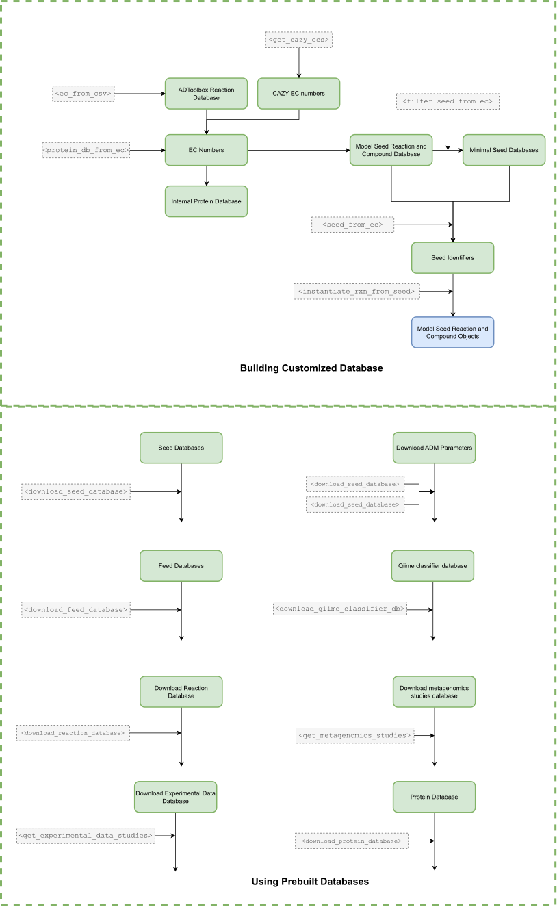
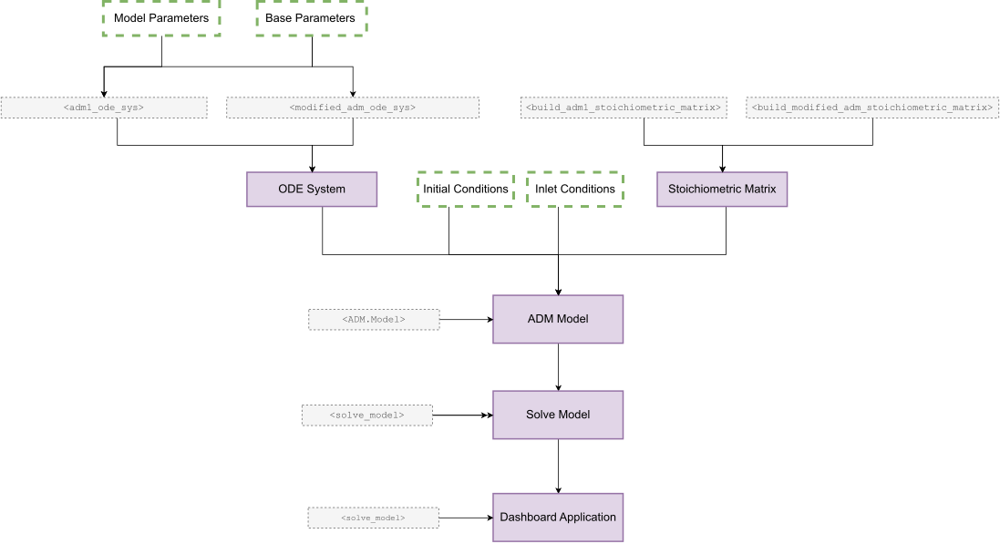

# API

ADToolbox has its own way of figuring out the path to the required files and configurations required for running different methods. The entire toolbox relies on the configs module. Objects of different classes in ADToolbox are instantiated by an instance
of the corresponding class in the configs module. For instance, if you want to use the methods of the metagenomics class in core module, you should do the following:

```
from adtoolbox import configs and core

metag_conf=configs.Metagenomics() 
metag_object=core.Metagenomics(metag_conf)

```

Doing this will result in that any core.Metagenomics method will refer to the defult configurations defined in the configs module. If you want to overwright the defult configuration, you can pass the desired argument to the configs.Metagenomics constructor. For example, if you want to change the docker repository for VSEARCH
you can:

```

metag_conf=configs.Metagenomics(vsearch_docker="mydocker") 
metag_object=core.Metagenomics(metag_conf)

```

Now when you execute the corresponding method in core.Metagenomics it will use mydocker repository instead of the defult. To learn more about defult configs, go to the configs api.

## core
You can access this module by:

```
from adtoolbox import core 

```
This module includes the following classes:

### 1. Experiment
::: adtoolbox.core.Experiment

### 2. Feed
::: adtoolbox.core.Feed

### 3. MetegenomicsStudy

::: adtoolbox.core.MetagenomicsStudy

### 4. Reaction

::: adtoolbox.core.Reaction

### 5. Metabolite

::: adtoolbox.core.Metabolite

### 6.SeedDB

::: adtoolbox.core.SeedDB

### 7. Database

Here is a schematic of the Database Module



::: adtoolbox.core.Database

### 8. Metagenomics

Here is a schematic view of core.Metagenomics API:


::: adtoolbox.core.Metagenomics


## adm

Here is a schematic view of adm API:



You can access this module by:

```
from adtoolbox import adm 

```
This module includes the following classes:

::: adtoolbox.adm

## configs
